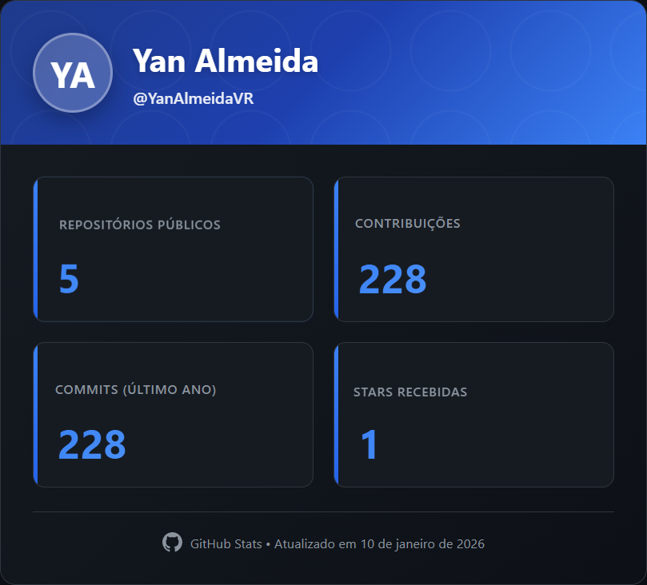

## Olá 👋, eu sou Yan Almeida

**Estudante de Engenharia de Software | Backend Developer em formação (Java)**

Sou estudante de Engenharia de Software no Inatel, com foco em desenvolvimento backend, arquitetura de sistemas e boas práticas de código. Tenho interesse em construir APIs escaláveis, sistemas bem estruturados e soluções orientadas a negócio.

Busco evoluir constantemente em **Java, Spring Boot, bancos de dados e arquitetura backend**, com foco em oportunidades de estágio e projetos práticos.

---

🌐 **Onde me encontrar**

  
    

---

🧠 **O que eu faço**

🧩 Desenvolvimento backend com **Java**

🏗️ Construção de **APIs REST**

📐 Aplicação de princípios de **POO e Clean Code**

🔐 Autenticação, autorização e segurança em nível introdutório

🗄️ Integração com bancos de dados relacionais

🐳 Noções de Docker e deploy

🐍 Desenvolvimento com Python para scripts utilitários e apoio a sistemas backend

🎓 Aprendizado contínuo e projetos acadêmicos/práticos

---

## 🛠 Stack Tecnológica

### ⚙️ Backend

### 🐍 Python (Desenvolvimento)

### 🗄 Banco de Dados

### 🧰 Ferramentas & DevOps

---

## 📊 Estatísticas do GitHub

---

🚀 **Objetivo Profissional**

Atualmente busco:

* Estágio em Backend / Java
* Projetos práticos para consolidar conhecimento
* Evolução em arquitetura, performance e segurança
* Explorar **integrações entre backend Java e serviços/scripts em Python**

⭐ Se algum projeto te ajudar, considere deixar uma estrela
🤝 Aberto a colaborações, aprendizado e novos desafios
